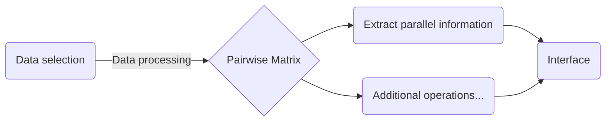
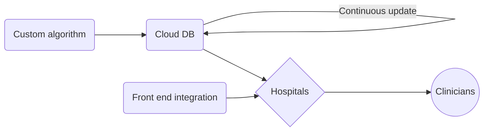

# LauzHack 2019
  
As part of the 2019 edition of **LauzHack**, our team has chosen to work on **genomic processing**. This project aims at creating value by substantially streamlining the genomic analysis of patients in a visual and efficient manner.

The way we achieve is by focusing on a pairwise comparison of DNA sequences as well as providing an interactive interface for practitioners.

From setting up a patient's risk profile to visualizating the likelihood of virus infections our end product is powerful, transparent and highly customizable. The clinician will be in control and have an instant diagnosis of his patient.

## Key Features
* Algorithmic
	* G-Matrix (Patients x Harmful Agents) [@Samuel]
	* Denoising of benign viruses
	* Cross correlation analysis
* Visualization
	* **Tree-of-life** relations
	ie: 
	* Superimposition of histograms
	* Interactive MVP [@Yann]

### Pipeline
* Back-end:

* Production:

## SOPHiA Partnership
SOPHiA GENETICS combines deep expertise in life sciences and medical disciplines with mathematical capabilities in data computing. Our mission is to bring data analytics solutions to market, to support healthcare professionals by maximizing the power of Data-Driven Medicine. We achieve this mission through the global adoption of SOPHiA artificial intelligence. SOPHiA is built using techniques such as statistical inference, pattern recognition and machine learning. This enables SOPHiA to provide equal benefits to all users, unite experts in a gold standard health tech platform, and motivate expert knowledge sharing for a sustainable impact on future patients.

### Participants
* Anton
* Nikita
* Samuel
* Yann
